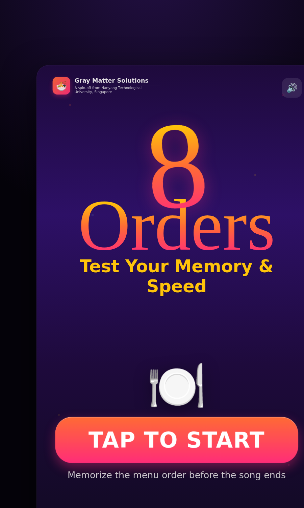

# 8 Orders — Test Your Memory & Speed

A fast-paced **memory game for a 43-inch vertical touchscreen**, implemented from
the [Touch Screen Game Figma design](https://www.figma.com/design/My0S4KpMu5LC7qhIedBk6E/Touch-Screen-Game?node-id=105-72).

Memorize the order that Thai-food plates are served, then tap them back in the
exact same order **before the song ends**.



## How to play

1. **Tap to start.**
2. On the clue page, **8 dishes reveal one-by-one in sync with the music** —
   each plate pops in exactly on a vocal hit ("whoo · ha · na · na · one · two ·
   three · four"). Memorize the order.
3. When the "?" slots appear, **tap the plates in the same order**.
   - A correct tap fills the next slot with a ✓.
   - A wrong tap = **Wrong menu** and costs a ❤️ life.
   - Let the song timer run out = **Time's up** and costs a life.
4. There are **always 8 tiles** (a 2×4 board). Difficulty climbs over **6 rounds**
   two independent ways, mirroring `eight_menus_logic.py`:
   - **Pattern** — how chunkable the board is. **Easy (R1–R2):** 2 orders in a
     structured layout. **Medium (R3–R4):** 3 orders, one row is a clean anchor.
     **Hard (R5–R6):** 3 orders, progressively less chunkable (near-alternating).
   - **Perception** — at the **Hard** tier one dish is swapped for a *look-alike
     twin* of another, so they're hard to tell apart at a glance.
   The dishes stay the same across the whole run (they just rearrange), so it's
   the **order** you're memorizing.
5. Clear the rounds to reach your **score /50**.
   - `≥ 38` → *Your memory is sharp!*
   - `20–37` → *Nicely done!*
   - `< 20` → *Room for improvement!*

Score = plates served correctly + a speed bonus for finishing rounds quickly.

## Running it

It's a **zero-dependency static app** — no build step, which is what a kiosk
needs. Any of these works:

```bash
# Just open the file
open index.html            # macOS
xdg-open index.html        # Linux

# …or serve it (recommended, so web fonts load)
python3 -m http.server 8000
# then visit http://localhost:8000
```

For a real kiosk, point a full-screen browser at `index.html`. The 1046×1860
design stage auto-scales to fit any screen while preserving its 9:16 portrait
aspect ratio.

## Design fidelity

Pulled directly from the Figma file:

| Token | Value |
| --- | --- |
| Stage | 1046 × 1860 (43" vertical, ~9:16) |
| Background | `linear-gradient(180deg, #1e0a3c, #2d1066 30%, #1e0a3c 60%, #0f0a1e)` |
| Wordmark "8 Orders" | `Just Another Hand`, gradient `#ffd700 → #ff6b35 → #ff2d78` |
| Headings | `Baloo Bhaijaan 2`; gold accent `#ffc40a` |
| Plate tile | `rgba(255,255,255,0.1)`, radius 32px, 205×205, 4×2 grid |
| Song timer | track `#d9d9d9`, fill gradient `#dc2626 → #eab308 → #22c55e` |
| Branding | Gray Matter Solutions — a spin-off from NTU, Singapore |

Dishes render from real plate art in `assets/dishes/<key>.png` (sliced from the
reference grid via `scripts/slice_dishes.py`), falling back to per-dish emoji
when a file is absent.

## Project structure

```
index.html          # markup + the scaled stage
assets/
  styles.css        # all design tokens & screen styles
  menus.js          # dish list + per-round difficulty config
  audio.js          # tiny WebAudio "to the beat" ticks & stingers
  game.js           # state machine, screens, timers, scoring
```

## Levels & dishes

The level system mirrors [`eight_menus_logic.py`](eight_menus_logic.py) and lives
in [`assets/menus.js`](assets/menus.js). It has two **decoupled layers**:

**Board layer** — each round is a 2×4 board of `a`/`b`/`c` "orders".
- *Easy* boards use exactly 2 orders. *3-order* boards obey the rule **one row
  uses all 3 orders, the other exactly 2** (a chunkable anchor row).
- Boards are enumerated and filtered by `chunk_score` (adjacency = chunkability),
  giving a large interchangeable pool per round (83/83/72/36/216/144 boards for
  R1–R6, matching the Python).

```js
window.ROUND_SPEC = [
  { rid: "R1", tier: "easy",   score: null, shape: null },
  { rid: "R2", tier: "easy",   score: null, shape: null },
  { rid: "R3", tier: "medium", score: 3,    shape: [3,1] }, // anchor = a triple
  { rid: "R4", tier: "medium", score: 3,    shape: [2,2] }, // anchor = clean pairs
  { rid: "R5", tier: "hard",   score: 2,    shape: null },  // one chunk removed
  { rid: "R6", tier: "hard",   score: 1,    shape: null },  // near-alternating
];
```

**Food layer** — dishes are assigned to tokens separately and **rotate every
launch** (`newFoodMap()`):
- `a`, `b` — two non-look-alike anchors, constant all session.
- `c` — a distinct 3rd dish at the medium tier; at the **hard** tier it becomes
  the **look-alike twin of `a`** (`LOOKALIKE_PAIRS`), the perceptual spike.

So the same board pool can wear different menus, and only the *order* changes
round to round. `RECALL_SECONDS` (8) is the answer window; the clue page runs one
pass of the music with the beat highlighting each tile in order.

### Dish art

Each dish renders from `assets/dishes/<key>.png`; if a file is missing the game
falls back to that dish's emoji, so it always runs. To generate the plate images
from the reference grid art:

```bash
pip install pillow
python3 scripts/slice_dishes.py path/to/grid.png
```

See [`assets/dishes/README.md`](assets/dishes/README.md) for the key list and how
to fix the tile→dish mapping.

### Music & beat sync

The clue-page reveals are locked to the backing track
[`assets/song.mp3`](assets/song.mp3) via a hand-tuned onset map:

```js
window.BEAT = {
  src: "assets/song.mp3",
  duration: 2.77,
  onsets: [0.186, 0.511, 0.673, 1.01, 1.498, 1.823, 1.997, 2.322], // seconds
};
```

Each entry is when a plate pops in. To use a different track, drop in a new
`song.mp3` and update `onsets` to its vocal hits (8 values). Times were derived
by spectral-flux onset detection on the original clip.

Add rounds, add dishes, or change lives (`START_LIVES` in `game.js`).
